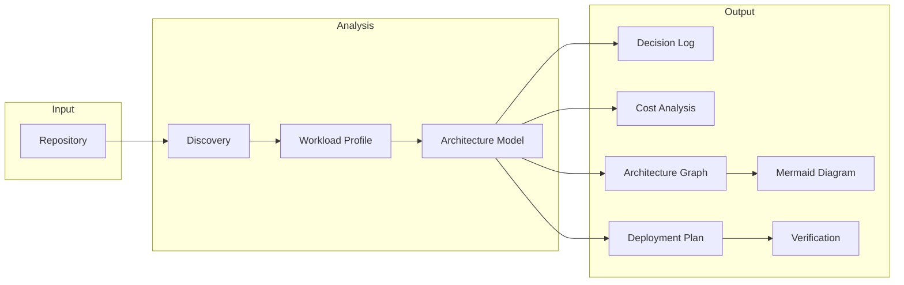

# AWS Repo Well-Architected Advisor

Schema-driven AWS architecture advisor and generator for repository analysis and platform design.

---

## What This Repository Does

- Analyzes IaC and application repositories (Terraform, CDK, CloudFormation, CI/CD, Kubernetes)
- Generates AWS architectures (EKS, ECS, Lambda, EC2) from workload profiles
- Produces structured, schema-backed outputs validated against JSON schemas
- Generates Mermaid diagrams from architecture models (graph-first, not freeform)
- Produces cost analysis with min/max USD/month estimates (heuristic today)
- Generates deployment plans, verification checklists, and operations runbooks
- Supports federal/NIST-aligned evaluations via `/federal-checklist` and control evidence mapping

---

## Key Capabilities

### Architecture & Design

- Workload profiling (Startup, Federal, Brownfield, Internal, Data Pipeline)
- Architecture model normalization (app_type, trust_boundary, traffic_profile, availability_target)
- Decision log with options considered, cheapest/optimized/recommended options, rationale, tradeoffs
- Platform selection (Lambda, ECS, EC2) with multi-factor scoring

### Validation & Quality Gates

- Schema validation for all artifacts (`npm run validate:schemas`)
- Quality gate verdict (READY / CONDITIONAL / NOT_READY)
- Evidence-based findings (observed, inferred, missing, contradictory, unverifiable)
- CI enforcement: tests, schema validation, diagram validation, documentation validation

### Diagrams

- Architecture graph → Mermaid pipeline (build_architecture_graph, graph_to_mermaid, validate_mermaid)
- Deterministic diagram generation from structured graph; no AI-generated prose
- Zone-based layout (internet, edge, compute, data, security)

### Cost Analysis

- Heuristic cost estimates (min/max USD/month per component)
- Cost drivers, savings opportunities, confidence scores
- Schema: `cost-analysis.schema.json`

### Operations

- Deployment plan (phased apply order, validation gates)
- Verification checklist (post-deploy checks)
- Operations runbook (procedures, rollback notes)

### Compliance

- Federal mode: NIST 800-53, 800-37, 800-190, 800-204; DoD Zero Trust, DevSecOps
- Control evidence mapping (`control-evidence.schema.json`)
- Alignment ratings (STRONG / PARTIAL / WEAK); never claims compliance or certification

---

## How It Works (System Flow)



1. **Repo** → Discovery inventories IaC, CI/CD, Kubernetes artifacts
2. **Workload Profile** → Infers type (Startup, Federal, Brownfield, etc.) and constraints
3. **Architecture Model** → Normalizes app_type, trust_boundary, selected services
4. **Decision Log** → Records options, rationale, tradeoffs, recommended choices
5. **Cost Analysis** → Estimates min/max monthly cost per component
6. **Architecture Graph** → Structured nodes/edges for diagram generation
7. **Mermaid Diagram** → Rendered from graph; validated for consistency
8. **Deployment Plan** → Phased apply order, validation gates
9. **Verification** → Checklist and runbook for post-deploy validation

---

## Outputs (Schema-Driven Artifacts)

All outputs validate against JSON schemas in `schemas/`. CI fails if validation fails.

| Artifact | Schema | Produced By |
|----------|--------|-------------|
| workload_profile | workload-profile.schema.json | /solution-discovery, /design-and-implement |
| architecture_model | architecture-model.schema.json | /platform-design |
| decision_log | decision-log.schema.json | /platform-design |
| cost_analysis | cost-analysis.schema.json | /platform-design |
| architecture_graph | architecture-graph.schema.json | /design-and-implement |
| Mermaid diagram | — | Rendered from architecture_graph |
| deployment_plan | deployment-plan.schema.json | /scaffold |
| verification_checklist | verification-checklist.schema.json | /scaffold |
| operations_runbook | operations-runbook.schema.json | /scaffold |
| incremental_fix | incremental-fix.schema.json | /incremental-fix |
| control_evidence | control-evidence.schema.json | /federal-checklist |
| Review output | review-score.schema.json | /repo-assess |

---

## Repository Structure

| Path | Purpose |
|------|---------|
| `schemas/` | JSON schemas for all artifacts |
| `scripts/` | build_architecture_graph, graph_to_mermaid, validate_mermaid, cost_estimator, estimate_costs, validate_docs |
| `examples/` | Golden scenarios (startup-saas, federal, brownfield), incremental-fix examples, validated-review-output.json |
| `docs/` | Usage, architecture, schemas, diagram conventions, cost model, testing |
| `tests/` | Schema validation, scenario tests, golden scenario validation, skill contract tests |
| `skills/` | AWS Well-Architected Pack (10 modules) |
| `.opencode/` | OpenCode config, commands, tools |

---

## Configuration Model (Terraform Output)

Terraform produced by the advisor follows a **variable-driven configuration model**. Users configure infrastructure through `.tfvars` files — not by editing resource files.

| Layer | Purpose |
|-------|---------|
| **variables.tf** | Defines all configurable inputs (project, environment, feature flags, sizing, compute/database mode) |
| **.tfvars files** | Where users make changes — per-environment templates (`dev.tfvars`, `stage.tfvars`, `prod.tfvars`) or `terraform.tfvars` |
| **Resource files** (.tf) | Consume variables only; do not edit unless extending the platform |

### tfvars Templates

Scaffolded Terraform **always** includes environment-specific tfvars templates:

| File | Purpose |
|------|---------|
| `dev.tfvars.example` | Copy to `dev.tfvars`; replace `ADD_VALUE_HERE` and `REPLACE_WITH_*` placeholders |
| `stage.tfvars.example` | Copy to `stage.tfvars` |
| `prod.tfvars.example` | Copy to `prod.tfvars` |

Templates use **placeholder values only** — never guess customer-specific values. Section order: Core → Ownership → Required → Secrets → Architecture (when applicable) → Tags.

See `docs/terraform-tfvars-templates.md` for full rules.

### How the Advisor Makes Decisions

The advisor uses workload profiles (Startup, Federal, Brownfield, etc.) to recommend:

- **Compute** — Lambda vs ECS vs EKS based on traffic, complexity, compliance
- **Database** — DynamoDB vs RDS vs none based on consistency and scale needs
- **Security** — KMS, CloudTrail, alarms — enabled when workload justifies
- **Cost** — NAT optional, single-AZ default; multi-AZ when HA required

All choices are exposed as variables so users can safely override defaults without modifying core Terraform.

---

## Getting Started

### Prerequisites

- Node.js >= 18
- Python 3.x (for scripts)
- OpenCode (for full command set) or Cursor/Claude Code (subset)

### Install

```bash
git clone https://github.com/Jade/aws-repo-well-architected-advisor.git
cd aws-repo-well-architected-advisor
npm install
cd .opencode && bun install   # or npm install
```

### Run

```bash
opencode run "/repo-assess"
```

Or: `opencode run "/quick-review"` for fast triage, `opencode run "/design-and-implement"` for end-to-end flow.

### Validate

```bash
npm test
npm run validate:schemas
npm run validate:diagrams
python3 scripts/validate_docs.py
```

If any fails, the pipeline fails. See [docs/testing.md](docs/testing.md).

---

## Example Workflow

**Input**: Repository with Terraform or app description (e.g., "API with Lambda, DynamoDB, 100K requests/month")

**Output**:

1. **workload_profile** — Startup, API, variable traffic
2. **architecture_model** — Lambda, DynamoDB, API Gateway
3. **decision_log** — Lambda vs ECS vs EC2; rationale and tradeoffs
4. **cost_analysis** — e.g., $50–150/month (heuristic)
5. **architecture_graph** — Nodes: Users, API Gateway, Lambda, DynamoDB; edges: HTTPS, Invoke, Query
6. **Mermaid diagram** — Rendered flowchart
7. **deployment_plan** — Phases: Foundation → Security → Compute
8. **verification_checklist** — Post-deploy checks
9. **operations_runbook** — Procedures, rollback notes

```bash
# Build graph from scenario
python3 scripts/build_architecture_graph.py --scenario examples/scenarios/startup-workload.json

# Render Mermaid
python3 scripts/graph_to_mermaid.py examples/architecture-graph-built.json examples/architecture-diagram-generated.mmd

# Cost estimate (CLI)
python3 scripts/cost_estimator.py --traffic 100000 --storage 50 --compute lambda
```

---

## Diagram System (Mermaid)

- Diagrams are generated from `architecture_graph` (structured JSON)
- Not freeform AI text; graph is source of truth
- Validated for syntax, node existence, edge consistency, zone grouping
- Pipeline: `build_architecture_graph` → `graph_to_mermaid` → `validate_mermaid`

See [docs/diagram-conventions.md](docs/diagram-conventions.md).

---

## Cost Model

**Current state**: Heuristic. Fixed rates in code; no live AWS pricing API calls.

**Assumptions**: Traffic (requests/month), storage (GB), compute type (lambda, ecs, ec2). Output: `estimated_monthly_cost_range` (min/max USD), component breakdown, confidence score.

**Not implemented**: AWS Price List API, Cost Explorer. Integration points documented in [docs/pricing-integration.md](docs/pricing-integration.md).

---

## Testing & Validation

- **Schema validation**: All examples and golden scenarios validate against schemas
- **Golden scenarios**: `examples/golden/startup-saas/`, `federal/`, `brownfield/` — full artifact sets
- **Incremental fix examples**: `examples/incremental-fix/` — Terraform, IAM, CI/CD patches
- **CI enforcement**: `npm test`, `validate:schemas`, `validate:diagrams`, `validate_docs.py`
- **Failure**: Any validation failure causes CI to fail

---

## Limitations

- **Pricing**: Heuristic only; Price List API and Cost Explorer not implemented
- **IaC parsing**: Terraform resource mapping is demonstrative; partial coverage
- **No automatic remediation**: Patch generation is simulation-only; no auto-apply
- **No terraform apply**: IaC generation only; user applies manually
- **Compliance**: Alignment ratings only; does not claim compliance, certification, or FedRAMP authorization
- **OpenCode primary**: Full command set requires OpenCode; Cursor/Claude use subset

---

## Roadmap

- Pricing API integration (Price List, Cost Explorer)
- Drift detection (repo vs deployed state)
- Multi-account / org topology modeling
- Remediation simulation (patch apply simulation)

---

## Contributing

- **Add schema**: Add to `schemas/`, add example to `examples/`, add to `tests/validate-schemas.js`
- **Add test**: Add to `tests/`; ensure `npm test` passes
- **Add scenario**: Add JSON to `examples/scenarios/` or `examples/golden/`; ensure it validates in `tests/scenarios/run-scenarios.js` or `run-golden.js`

See [CONTRIBUTING.md](CONTRIBUTING.md).

---

## License

MIT
