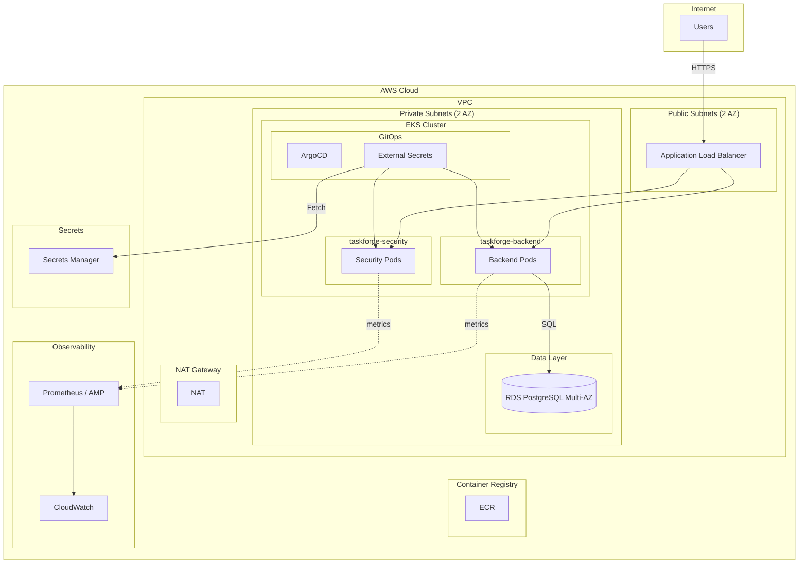

# Target Architecture — TaskForge Platform on AWS

**Output from /platform-design**  
**Date:** 2025-03-20

**Terraform:** See [taskforge-platform-infra](https://github.com/LongTheta/taskforge-platform-infra) (standalone repository).

---

## Target Architecture Summary

| Pillar | Choice | Rationale |
|--------|--------|-----------|
| **Compute** | EKS 1.28+ (managed node group) | Existing Kustomize + ArgoCD; container-native. Managed nodes reduce ops. |
| **Storage** | RDS PostgreSQL 15 (Multi-AZ) | Backend requires PostgreSQL; Multi-AZ for ~99.9% availability. |
| **Network** | VPC, 2 AZs, private subnets for EKS + RDS, public for ALB | Standard AWS pattern; no 0.0.0.0/0 on workloads. |
| **IAM** | IRSA for EKS pods; least-privilege roles for External Secrets, RDS access | No long-lived keys in pods. |
| **CI/CD** | GitHub Actions → ECR; ArgoCD syncs from Git | Existing CI; add ECR push. ArgoCD in-cluster. |
| **Observability** | CloudWatch Container Insights, Prometheus (AMP or self-hosted), Grafana | Align with existing /metrics endpoints. |

---

## Architecture Diagram (Mermaid)

---

## Decision Log

| ID | Decision | Choice | Alternatives Considered |
|----|----------|--------|-------------------------|
| D1 | Compute | EKS managed node groups | ECS Fargate — rejected: Kustomize/ArgoCD assume K8s; migration cost |
| D2 | Database | RDS PostgreSQL 15 Multi-AZ | Aurora — rejected for cost at current scale; can upgrade later |
| D3 | Secrets | AWS Secrets Manager + ESO | Parameter Store — SM preferred for rotation, structured secrets |
| D4 | Ingress | ALB + AWS Load Balancer Controller | NLB — ALB for path-based routing (backend vs security) |
| D5 | Registry | ECR | GHCR — ECR for AWS-native, lower latency, no cross-cloud |
| D6 | Observability | Prometheus + Grafana (or AMP) | CloudWatch only — Prometheus aligns with existing /metrics |

---

## Tradeoffs

- **EKS vs ECS:** EKS adds cluster management cost but preserves existing GitOps flow. ECS would require rewriting Kustomize → ECS task defs.
- **RDS vs Aurora:** RDS sufficient for low–moderate traffic; Aurora when scaling or read replicas needed.
- **NAT Gateway:** ~$32/mo per AZ; consider NAT instance for dev to reduce cost.

---

## Required AWS Services

| Service | Purpose |
|---------|---------|
| EKS | Kubernetes cluster for backend + security |
| RDS PostgreSQL | Backend database |
| VPC | Network isolation |
| ECR | Container registry |
| Secrets Manager | DATABASE_URL, SECRET_KEY, API_KEY |
| ALB | Ingress for backend (8000) and security (8081) |
| IAM | IRSA, EKS node role, RDS access |
| CloudWatch | Logs, metrics, Container Insights |

---

## Cost Snapshot (Rough Monthly)

| Component | Est. Monthly |
|-----------|--------------|
| EKS control plane | $73 |
| 2x t3.medium nodes | ~$60 |
| RDS db.t3.micro Multi-AZ | ~$30 |
| NAT Gateway (2 AZ) | ~$65 |
| ALB | ~$20 |
| ECR, Secrets Manager, data transfer | ~$15 |
| **Total** | **~$260–300** |

*Dev: Single AZ, smaller instance, NAT instance → ~$120–150.*
