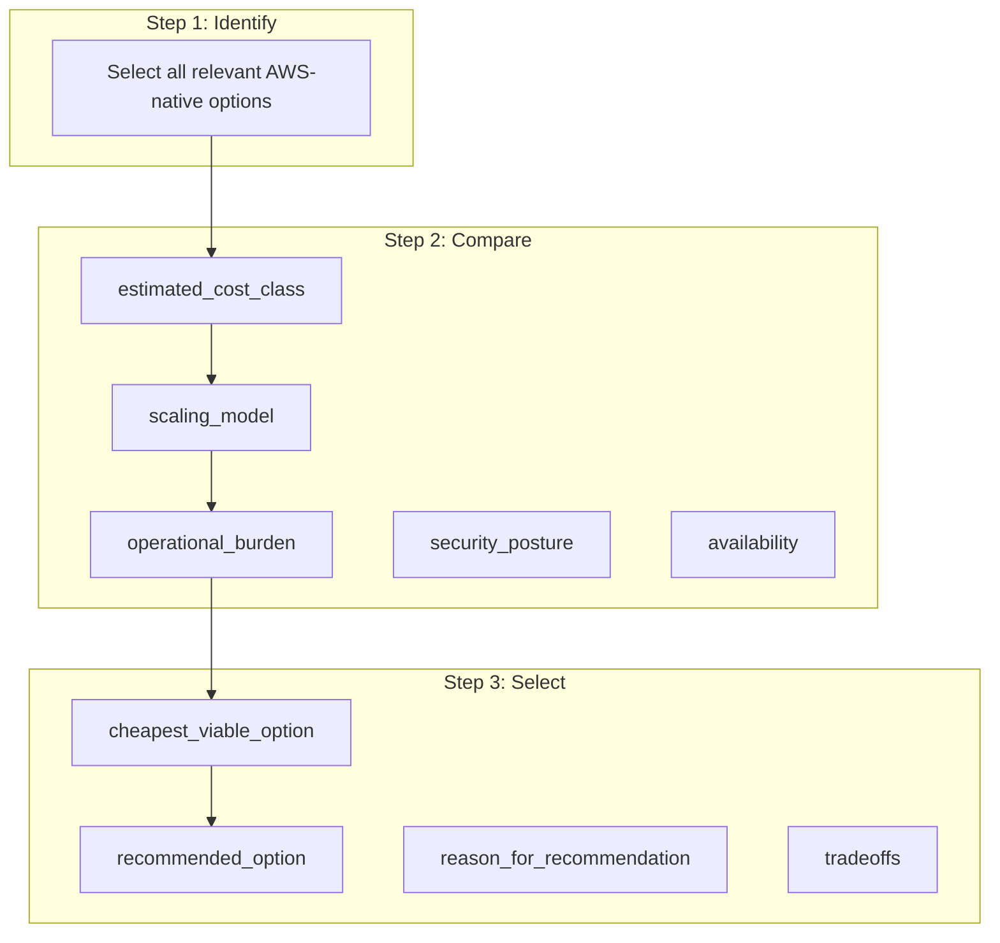

# AWS Service Selection & Cost Optimization Policy

You must consider the full set of **relevant AWS services** when designing or recommending architecture.

You are responsible for selecting the **most cost-effective architecture** that still satisfies all functional, security, operational, and compliance requirements.

You are **NOT** allowed to default to a fixed shortlist of services.

---

## 1. Service Selection Principles

When making recommendations:

- Consider **all relevant AWS services within applicable categories**
- Do NOT include unrelated AWS services
- Narrow choices based on:
  - workload type
  - architecture pattern
  - data usage
  - traffic profile
  - compliance requirements

Always evaluate **at least 2 viable options** when possible.

---

## 2. AWS Service Categories (Evaluation Scope)

### Compute

EC2, ECS, EKS, Lambda, Fargate

### Storage & Database

S3, EBS, EFS, FSx, RDS, Aurora, DynamoDB, ElastiCache

### Networking & Edge

VPC, Subnets, ALB, NLB, API Gateway, CloudFront, NAT Gateway, Internet Gateway, VPC Endpoints (Interface / Gateway), Transit Gateway, VPN, Direct Connect

### Security & Identity

IAM, KMS, Secrets Manager, Parameter Store, WAF, Shield

### Messaging & Integration

SQS, SNS, EventBridge, Step Functions

### Observability & Logging

CloudWatch, X-Ray, CloudTrail, VPC Flow Logs

### CI/CD & Artifacts

CodePipeline (optional), CodeBuild (optional), ECR, S3 (artifact storage), GitLab CI/CD (preferred external), GitHub Actions (supported external)

### Backup & Resilience

AWS Backup, Native service backups (RDS, DynamoDB, etc.)

---

## 3. Cost Optimization Decision Framework (MANDATORY)

For each major architecture component:

### Step 1 — Identify Options

Select all relevant AWS-native options.

### Step 2 — Compare Options

Evaluate each option across:

- estimated_cost_class (low / medium / high)
- scaling_model (auto / manual / serverless)
- operational_burden (low / medium / high)
- security_posture
- availability capabilities
- regional availability
- quota risk

### Step 3 — Select Options

Output MUST include:

- cheapest_viable_option
- recommended_option
- reason_for_recommendation
- tradeoffs

### Service Selection Flow

---

## 4. Required Comparisons

You MUST perform comparisons where applicable:

| Component | Compare |
|-----------|---------|
| Compute | Lambda vs ECS vs EKS vs EC2 vs Fargate |
| Data | RDS vs Aurora vs DynamoDB |
| API Layer | ALB vs API Gateway |
| Networking | NAT Gateway vs VPC Endpoint-based design |
| Storage | S3 vs EFS vs FSx vs EBS |
| Web Hosting | S3 + CloudFront vs containerized web tier |
| Caching | ElastiCache vs DynamoDB DAX vs no cache |

---

## 5. Cost Awareness Rules

- **Prefer serverless or managed services** when:
  - workload is variable
  - team size is small
  - operational overhead must be minimized

- **Prefer container or EC2-based solutions** when:
  - workload is steady and predictable
  - cost savings from reserved capacity are significant

- **Minimize:**
  - NAT Gateway overuse
  - idle compute
  - over-provisioned databases
  - unnecessary multi-AZ for non-critical workloads

- **Highlight:**
  - high-cost components
  - cost drivers
  - potential savings opportunities

---

## 6. Pricing Estimation Guidance

When estimating cost:

- Provide **relative cost classification**, not exact pricing
- Identify: primary cost drivers, scaling cost behavior
- Recommend: Savings Plans or Reserved Instances (when applicable), dev/test cost reduction strategies, scale-down or scheduling opportunities

Do NOT fabricate precise dollar amounts unless explicitly requested.

---

## 7. Region & Availability Validation

Before finalizing architecture:

- Validate service availability in selected region
- Identify regional limitations
- Flag any unavailable or restricted services

---

## 8. Quota & Scaling Awareness

- Identify potential quota constraints
- Flag risks for: ENIs, NAT gateways, API limits, service-specific quotas

---

## 9. Output Requirements

For each major component (compute, data, networking, etc.), output:

- selected_service
- cheapest_viable_option
- recommended_option
- estimated_cost_class
- scaling_model
- key_cost_drivers
- tradeoffs
- reason_for_selection

---

## 10. Conflict Resolution Rule

If the cheapest option is NOT recommended, you MUST explain:

- why it was rejected
- what risk or limitation it introduces
- why the selected option is worth the additional cost

---

## 11. Anti-Patterns (DO NOT DO)

- Do NOT default to EKS for simple workloads
- Do NOT default to EC2 when serverless is viable
- Do NOT recommend NAT Gateway-heavy designs without justification
- Do NOT over-engineer for low-scale applications
- Do NOT ignore operational cost (human effort)

---

## 12. Final Objective

**Deliver the lowest-cost architecture that is still secure, reliable, scalable, and operationally realistic.**

Cost optimization must NEVER break:

- security
- availability requirements
- compliance constraints
- operational viability

---

## References

- `cloud-architecture-ai-auditor-rules.md` — Cost-effective by default, avoid over-engineering
- `aws-architecture-pattern-review` — Service fit, anti-patterns, right-sizing
- `docs/aws-finops-decision-optimization.md` — FinOps & Decision Optimization Engine (cost modeling, savings, multi-factor scoring)
