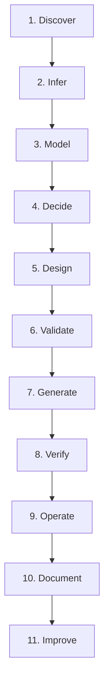
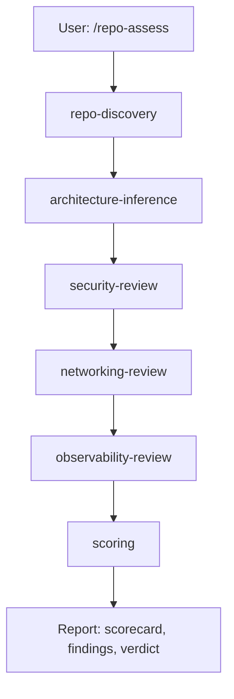
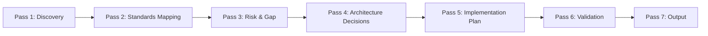
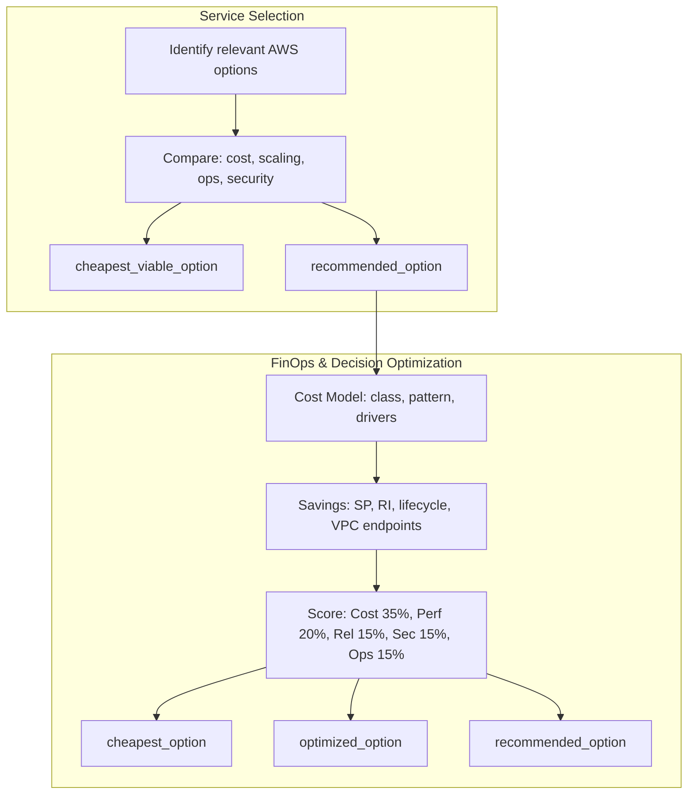
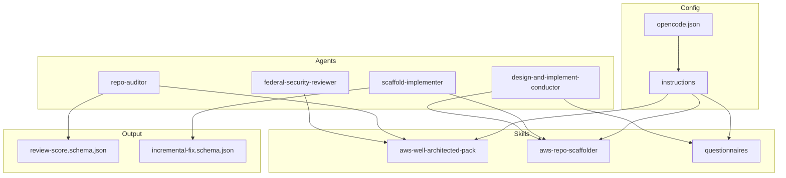

# Architecture

How the AWS Repo Well-Architected Advisor works.

---

## Purpose

The advisor evaluates repositories against AWS Well-Architected pillars and federal standards (NIST SP 800-series, DoD Zero Trust, DoD DevSecOps). It acts as a **full lifecycle implementation engine** (v5): translating repository reality, user requirements, and platform constraints into a deployable, validated, observable, and operable AWS platform. It produces evidence-based findings, control mappings, architecture decisions, runbooks, and production-ready Terraform/CDK scaffolding. It operates as a Principal Cloud Architect and federal-grade DevSecOps reviewer.

---

## v5 Lifecycle (11 Steps)

Per `docs/AI-CLOUD-ARCHITECT-AGENT-V5.md`, design-and-implement and scaffold workflows follow:

| Step | Purpose |
|------|---------|
| 1. Discover | Analyze repo and inputs |
| 2. Infer | Determine application architecture (app type, runtime, data patterns) |
| 3. Model | Build normalized architecture model (app_type, trust_boundary, traffic_profile, availability_target, etc.) |
| 4. Decide | Make architecture decisions (platform selection, data strategy) |
| 5. Design | Produce target architecture (environment/account strategy, bootstrap layer) |
| 6. Validate | Preflight checks (CIDR, AZ, quotas, HA) before generation |
| 7. Generate | Terraform/CDK + CI/CD + configs |
| 8. Verify | Testing + validation plan |
| 9. Operate | Observability + runbooks |
| 10. Document | Evidence + audit + onboarding |
| 11. Improve | Roadmap + optimization plan |

---

## Repository Assessment Flow

1. **repo-discovery**: Inventory repo artifacts (IaC, CI/CD, K8s manifests, Dockerfiles)
2. **architecture-inference**: Infer compute, data, networking, identity models
3. **security-review**: IAM, secrets, encryption, least privilege
4. **networking-review**: VPC, subnets, segmentation, flow logs
5. **observability-review**: Metrics, logs, traces, alerting
6. **scoring**: Weighted score, letter grade, production readiness

---

## Multi-Pass Reasoning Engine

Per `docs/AI-CLOUD-ARCHITECT-AGENT-NIST-DOD.md`, the advisor uses a 7-pass flow for DEEP_ANALYSIS and FEDERAL_MODE:

| Pass | Purpose |
|------|---------|
| 1. Discovery | Inventory artifacts, classify models, identify missing evidence |
| 2. Standards Mapping | Map repo behaviors to NIST/DoD categories; separate observed, inferred, missing, contradictory |
| 3. Risk & Gap | Identify risks, anti-patterns; assign severity (Critical/High/Medium/Low) |
| 4. Architecture Decisions | Propose options; compare security, ops, auditability, cost; record decision log |
| 5. Implementation Plan | Phases: Foundation, Identity, Network, Compute, Data, Logging, CI/CD, Evidence |
| 6. Validation | Re-check against Well-Architected, NIST, DoD; flag assumptions |
| 7. Output | Architecture summary, control mapping, remediation plan, Terraform/CDK, CI/CD, evidence hooks |

---

## Findings Generation

Findings are generated by specialist modules and aggregated by the conductor. Each finding must include:

- **evidence_type**: observed | inferred | missing | contradictory | unverifiable
- **confidence** or **confidence_score** (0.0–1.0)
- **source_reference**: file, path, pattern, or explicit absence (v3)
- **affected_standard**: AWS_WELL_ARCHITECTED, NIST_*, DOD_* (v3 federal)
- **implementation_status**: implemented | partially_implemented | missing | cannot_verify_from_repo (v3)
- **severity**: CRITICAL | HIGH | MEDIUM | LOW
- **recommendation**

Never assume compliance from naming. Never treat a policy document as proof of implementation.

---

## Cost & FinOps Decision Flow

When making architecture decisions (platform selection, data strategy, networking, storage), apply both:

1. **Service Selection** — Identify options → Compare (cost, scaling, ops, security) → Select cheapest_viable + recommended
2. **FinOps & Decision Optimization** — Cost Model → Savings Optimization → Multi-Factor Scoring → Output cheapest / optimized / recommended

See [aws-finops-decision-optimization.md](aws-finops-decision-optimization.md) and [cloud-architecture-ai-auditor/aws-service-selection-policy.md](../cloud-architecture-ai-auditor/aws-service-selection-policy.md).

---

## Decision Tracking

The advisor maintains a decision log with:

- decision_id
- context
- options_considered
- selected_option
- rationale
- tradeoffs
- impacted_components
- affected_controls_or_principles

All generated output must remain consistent with prior decisions.

---

## Infrastructure Generation

When `/scaffold` or `/design-and-implement` runs:

1. **Input**: Target architecture, `infrastructure_config` (tagging, CIDR, roles)
2. **Output**: Terraform or CDK for VPC, subnets, SGs, IAM/IRSA, KMS, logging, CI/CD skeleton
3. **Rules**: Private-by-default, no 0.0.0.0/0 on sensitive resources, least-privilege IAM, customer-managed KMS, VPC Flow Logs, CloudTrail placeholders
4. **Apply**: Always manual; user runs `terraform apply` after review

---

## Incremental Fix Mode

For existing repos, `/incremental-fix`:

- Prefers minimal targeted fixes over full rebuilds
- Generates patch-style changes: Terraform patches, IAM corrections, CI/CD updates, security fixes
- Each fix includes: risk_reduction, affected_control_area, effort, priority, evidence_required_to_close
- Output per `schemas/incremental-fix.schema.json`

---

## Federal / NIST / DoD Mode

When `/federal-checklist` runs:

- **Standards**: NIST 800-53, 800-37, 800-190, 800-204; DoD Zero Trust, DoD DevSecOps
- **Control mapping**: Access Control, Audit, Configuration, System/Communications, Supply Chain, Contingency, Zero Trust pillars
- **Outputs**: NIST_ALIGNMENT, DOD_ALIGNMENT (STRONG | PARTIAL | WEAK)
- **Claims**: Allowed only — "aligned with", "supports", "lacks evidence for"; never "compliant", "certified", "FedRAMP authorized"

---

## Component Overview

