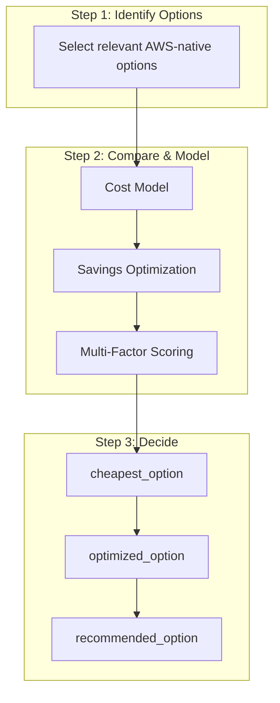

# AWS FinOps & Decision Optimization Engine

Architecture decisions must be evaluated using a combined:

- **Cost Model**
- **Savings Optimization Model**
- **Multi-Factor Decision Scoring Engine**

See also: [cloud-architecture-ai-auditor/aws-service-selection-policy.md](../cloud-architecture-ai-auditor/aws-service-selection-policy.md) for service selection principles.

---

## 1. Cost Modeling (MANDATORY)

For each architecture component:

### Identify

- **estimated_cost_class**: low | medium | high
- **cost_pattern**: fixed | usage-based | burst-driven
- **primary cost drivers**: compute hours, data transfer, storage, requests

### Evaluate

- baseline monthly cost behavior
- scaling cost impact
- idle cost risk

---

## 2. Savings Optimization Model

Where applicable, recommend:

| Category | Strategies |
|----------|------------|
| **Compute Savings** | Savings Plans (EC2, Fargate, Lambda), Reserved Instances (RDS, EC2) |
| **Storage Optimization** | S3 lifecycle policies, infrequent access tiers, archive tiers |
| **Database Optimization** | Right-sizing, serverless vs provisioned |
| **Network Optimization** | NAT Gateway reduction, VPC endpoint alternatives |
| **Environment Optimization** | dev/test shutdown schedules, auto-scaling policies, ephemeral environments |

---

## 3. Multi-Factor Decision Scoring Engine

Each major architecture decision must be scored:

### Scoring Dimensions (0–10)

| Dimension | Weight |
|-----------|--------|
| Cost Efficiency | 35% |
| Performance | 20% |
| Reliability | 15% |
| Security | 15% |
| Operational Complexity | 15% |

### Output

- **total_score** (0–10)
- **score_breakdown**
- **reasoning**

---

## 4. Decision Flow

---

## 5. FinOps Decision Flow (Detail)

```mermaid
flowchart LR
    subgraph CostModel["Cost Modeling"]
        CM1[estimated_cost_class]
        CM2[cost_pattern]
        CM3[primary_cost_drivers]
    end
    
    subgraph Savings["Savings Optimization"]
        S1[Compute: SP/RI]
        S2[Storage: lifecycle]
        S3[Network: VPC endpoints]
    end
    
    subgraph Scoring["Decision Scoring"]
        SC1[Cost 35%]
        SC2[Perf 20%]
        SC3[Rel 15%]
        SC4[Sec 15%]
        SC5[Ops 15%]
    end
    
    subgraph Output["Output"]
        O1[cheapest_option]
        O2[optimized_option]
        O3[recommended_option]
    end
    
    CostModel --> Savings
    Savings --> Scoring
    Scoring --> Output
```

---

## 6. Decision Output (REQUIRED)

For each major component:

- **cheapest_option**
- **optimized_option** (after savings strategies)
- **recommended_option**
- **total_score**
- **reasoning**

---

## 7. Decision Logic Rules

- The **cheapest option is NOT always** the recommended option
- Prefer **optimized_option** if:
  - cost savings are significant
  - risk is not increased
- Prefer **recommended_option** if:
  - it meaningfully improves reliability, security, or operational simplicity

---

## 8. Tradeoff Transparency

You MUST explicitly explain:

- why one option was chosen over another
- what is sacrificed (cost, performance, complexity)
- what risk is introduced or reduced

---

## 9. Anti-Patterns

- Do NOT recommend cheapest if it increases risk significantly
- Do NOT recommend expensive solutions without justification
- Do NOT ignore long-term cost trends
- Do NOT ignore operational cost (engineering effort)

---

## 10. Output Requirements

For each decision include:

- **cost_summary**
- **savings_opportunities**
- **decision_score**
- **recommended_path**
- **alternative_path**
- **explanation**

---

## 11. Final Objective

**Deliver the most cost-efficient architecture that balances performance, reliability, security, and operational simplicity over time — not just the lowest immediate cost.**
