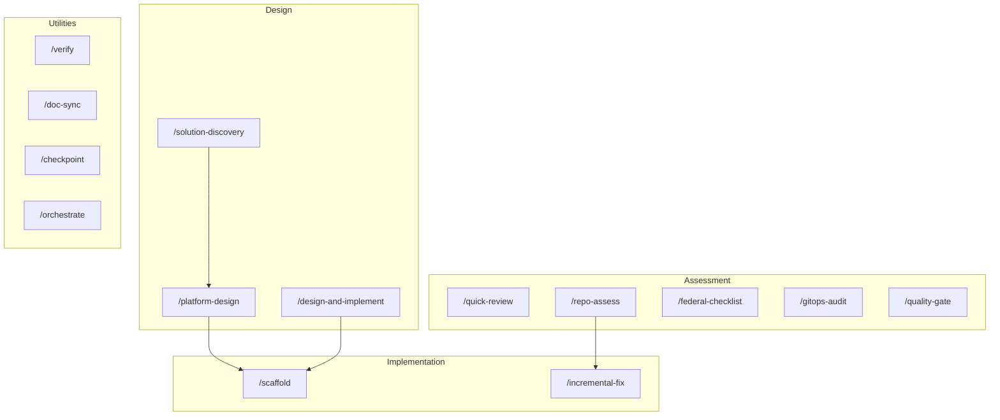

# Commands Reference

All commands supported by the AWS Repo Well-Architected Advisor. Defined in `.opencode/opencode.json` and `opencode.json`.

---

## Command Flow Overview



Design flows apply **Service Selection** and **FinOps & Decision Optimization** per [aws-finops-decision-optimization.md](aws-finops-decision-optimization.md).

---

## /quick-review

**What it does**: Light assessment. Discovery → top risks → score. Skips full multi-pass.

**Expected inputs**: Repository context (IaC, CI/CD, manifests)

**Expected outputs**: letter_grade, production_readiness, top 5 findings

**When to use**: Fast triage, initial feedback

**Example prompt**: "Run /quick-review" or "Quick assessment of this repo"

---

## /repo-assess

**What it does**: Full repository architecture assessment. DEEP_ANALYSIS mode. Executes: repo-discovery → architecture-inference → security-review → networking-review → observability-review → scoring.

**Expected inputs**: Repository context

**Expected outputs**: Weighted scorecard, findings (with evidence tags), production readiness, top remediation priorities. Per `schemas/review-score.schema.json`.

**When to use**: Production readiness check, formal assessment

**Example prompt**: "Run /repo-assess" or "Full Well-Architected assessment"

---

## /solution-discovery

**What it does**: Requirements discovery. Asks (1) business requirements via aws-app-platform-questionnaire, (2) infrastructure & governance via infrastructure-governance-questionnaire (tagging, CIDR, IAM roles).

**Expected inputs**: Repo context (optional); user answers to questionnaires

**Expected outputs**: Solution brief per `schemas/solution-brief.schema.json` including `infrastructure_config`

**When to use**: Starting a new design; need requirements before architecture

**Example prompt**: "Run /solution-discovery" or "Discover requirements for this project"

---

## /platform-design

**What it does**: Platform design from discovery. Constraints synthesis → reference architecture → decision log.

**Expected inputs**: Solution brief or discovery output

**Expected outputs**: Target architecture, rationale, decision log

**When to use**: Have requirements; need reference architecture

**Example prompt**: "Run /platform-design" or "Design platform from discovery"

---

## /scaffold

**What it does**: Generate IaC from architecture per v5. Uses aws-repo-scaffolder. Produces Terraform, CDK, or CloudFormation plus CI/CD configs. Includes: VPC, subnets, security groups, KMS, IAM/IRSA, observability (logs, metrics, alarms), CI/CD with SAST, dependency scan, image scan, IaC scan, SBOM. Tagging enforced. Preflight validation before generation.

**Expected inputs**: Target architecture or review findings; optionally `infrastructure_config`

**Expected outputs**: IaC files (Terraform/CDK), CI/CD configs (GitHub Actions, GitLab CI), README, runbooks. Marked as scaffolding — user reviews before apply.

**When to use**: Have design or findings; need IaC

**Example prompt**: "Run /scaffold" or "Generate Terraform from this architecture"

---

## /design-and-implement

**What it does**: End-to-end flow per v5 lifecycle. (1) Discover repo and inputs, (2) Infer application architecture, (3) Model normalized architecture, (4) Decide (platform selection, data strategy), (5) Design target architecture, (6) Validate preflight, (7) Generate Terraform/CDK + CI/CD. MUST collect: project, environment, owner, cost_center, vpc_cidr, roles (CI, developer, auditor). Produces runbooks, testing plan, cost estimate, verification checklist.

**Expected inputs**: Repo context; user answers to questionnaires

**Expected outputs**: Solution brief, architecture model, decision log, target architecture, IaC files, testing plan, runbooks, cost estimate, verification checklist

**When to use**: Read repo → requirements → recommend → code in one flow; full lifecycle implementation

**Example prompt**: "Run /design-and-implement" or "Read this repo, ask requirements, and generate Terraform"

---

## /incremental-fix

**What it does**: Patch-style fixes for existing repos. Does NOT rebuild. (1) repo-discovery or prior findings, (2) identify top gaps, (3) generate patches (Terraform, IAM, CI/CD, security). Each fix includes: risk_reduction, affected_control_area, effort, priority, evidence_required_to_close.

**Expected inputs**: Prior /repo-assess findings or repo context

**Expected outputs**: Fixes per `schemas/incremental-fix.schema.json`

**When to use**: Existing repo with gaps; want targeted fixes, not full scaffold

**Example prompt**: "Run /incremental-fix" or "Generate patch-style fixes for these findings"

---

## /federal-checklist

**What it does**: Federal-grade review. Discovery → standards mapping (NIST 800-53, 800-37, 800-190, 800-204; DoD Zero Trust, DevSecOps) → control alignment → readiness. Outputs NIST_ALIGNMENT and DOD_ALIGNMENT. Uses allowed claims only.

**Expected inputs**: Repository context

**Expected outputs**: Control alignment summary, NIST_ALIGNMENT, DOD_ALIGNMENT (STRONG/PARTIAL/WEAK), findings with affected_standard, implementation_status

**When to use**: Federal or DoD-aligned environments; compliance evidence

**Example prompt**: "Run /federal-checklist" or "Federal compliance review"

---

## /gitops-audit

**What it does**: GitOps and DevSecOps audit. repo-discovery → CI/CD review → ArgoCD/Flux assessment → deployment safety → observability.

**Expected inputs**: Repository context (CI/CD, ArgoCD/Flux configs)

**Expected outputs**: Audit report per scoring model

**When to use**: CI/CD, GitOps, ArgoCD, Flux review

**Example prompt**: "Run /gitops-audit" or "Audit GitOps setup"

---

## /quality-gate

**What it does**: Production readiness quality gate. Runs full review pipeline. Writes verdict to `.opencode/quality-gate-result.json`. Blocks push when `AWS_PACK_ENFORCE_QUALITY_GATE=true` and verdict is NOT_READY.

**Expected inputs**: Repository context

**Expected outputs**: Verdict (READY / CONDITIONAL / NOT_READY), weighted_score, letter_grade, timestamp in `.opencode/quality-gate-result.json`

**When to use**: Before push; enforce quality gate

**Example prompt**: "Run /quality-gate" or "Quality gate check"

---

## /doc-sync

**What it does**: Sync architecture docs with inferred design. Updates `docs/architecture.md` from repo state. Preserves evidence tags and findings.

**Expected inputs**: Repository context; prior review output

**Expected outputs**: Updated `docs/architecture.md`

**When to use**: Keep docs in sync with repo

**Example prompt**: "Run /doc-sync" or "Sync architecture docs"

---

## /verify

**What it does**: Verify findings have required evidence tags. Validates severity and confidence. Checks against `schemas/review-score.schema.json`.

**Expected inputs**: Findings (from prior review or inline)

**Expected outputs**: Verification report: pass | pass_with_warnings | fail

**When to use**: QA on AI-generated findings

**Example prompt**: "Run /verify" or "Verify findings have evidence tags"

---

## /checkpoint

**What it does**: Checkpoint current review state. Summarizes: artifacts discovered, architecture inferred, findings so far, scores.

**Expected inputs**: Session context

**Expected outputs**: Checkpoint summary

**When to use**: Preserve state between sessions

**Example prompt**: "Run /checkpoint"

---

## /orchestrate

**What it does**: Orchestrate multi-phase review. (1) discovery, (2) inference, (3) specialist reviews, (4) scoring, (5) report. Tracks state between phases.

**Expected inputs**: Repository context

**Expected outputs**: Full report from orchestrated phases

**When to use**: Explicit multi-phase orchestration

**Example prompt**: "Run /orchestrate"

---

## Generic Prompts

Reusable prompts for common workflows. See `prompt-template.md` for full template.

**Multi-repo assessment (TaskForge stack)** — run from taskforge-platform-infra:
```
Assess the TaskForge stack: read taskforge-backend and taskforge-security, infer the full architecture, produce recommendations, and update this repo with assessments and Terraform patches.
```

**App repo not ready for Terraform** — creates `{app-name}-platform-infra` with fixes stubs (no Terraform until baseline met):
```
Assess [app-repo-path]. Create {app-repo-name}-platform-infra with README ("You need to fix these"), docs/assessment/, fixes/ (one stub per finding). No Terraform until app meets baseline.
```
