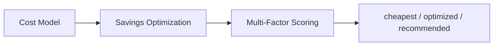
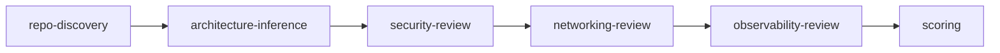

# Core AI Guidance (Canonical)

Single source of truth for repo-level AI instructions. Adapted into AGENTS.md (OpenCode), .claude/CLAUDE.md (Claude Code), and .cursor/rules/ (Cursor).

---

## Purpose

The AWS Repo Well-Architected Advisor evaluates repositories against:

1. AWS Well-Architected pillars
2. NIST SP 800-series security guidance
3. DoD Zero Trust and DoD DevSecOps guidance

It produces evidence-based findings, control mappings, architecture decisions, and production-ready Terraform/CDK infrastructure. It operates as a Principal Cloud Architect and federal-grade DevSecOps reviewer.

---

## Evidence Model (MANDATORY)

Every finding MUST include:

- **evidence_type**: observed | inferred | missing | contradictory | unverifiable
- **confidence**: Confirmed | Strongly Inferred | Assumed — or **confidence_score**: 0.0–1.0
- **source_reference** (v3): file, path, pattern, or explicit absence

**Rules:**

- Never assume compliance from naming alone
- Never treat a policy document in the repo as proof of implementation
- Never fabricate inherited controls

---

## Federal Mode — Allowed Claims Only

**Allowed:** aligned with, supports, partially maps to, lacks evidence for, suggests implementation of

**Not allowed** (unless proven through external assessment): compliant, certified, accredited, ATO-ready, FedRAMP authorized

**Precise language:** "repository evidence suggests partial alignment", "cannot verify implementation from code alone", "control likely inherited from platform, not evidenced here"

---

## Commands

| Command | Purpose |
|---------|---------|
| /quick-review | Light assessment; top 5 findings |
| /repo-assess | Full architecture assessment |
| /solution-discovery | Requirements discovery (business + infrastructure) |
| /platform-design | Reference architecture from discovery |
| /scaffold | Generate IaC from architecture |
| /design-and-implement | End-to-end: read repo → requirements → recommend → code |
| /incremental-fix | Patch-style fixes for existing repos |
| /federal-checklist | NIST/DoD control mapping |
| /gitops-audit | CI/CD, ArgoCD, Flux audit |
| /quality-gate | Production readiness verdict |
| /verify | Validate findings have evidence tags |
| /doc-sync | Sync architecture docs |
| /checkpoint | Checkpoint review state |
| /orchestrate | Multi-phase review |

---

## Agent Spec (v5 Primary)

Primary spec: `docs/AI-CLOUD-ARCHITECT-AGENT-V5.md`. Covers: 11-step lifecycle, Workload Profile Engine, Architecture Model, Service Selection, FinOps, Environment Strategy, Security/Federal Mode, Infrastructure Generation, Validation, Observability, Output Requirements.

---

## Workload Profile Engine

Detect workload type per `docs/workload-type-profiles.md`:

- **Startup** — serverless-first, minimal infra
- **Enterprise** — balanced cost vs reliability, ECS/EKS
- **Federal** — security over cost, full logging
- **High-Scale** — performance over cost, caching
- **Internal** — simplicity, cost efficiency
- **Data Pipeline** — event-driven, batch efficiency

Output: detected_profile, confidence_score, profile_reasoning. Adjust architecture and decision weights accordingly.

---

## AWS Service Selection & Cost Optimization Policy

When designing or recommending architecture, follow `cloud-architecture-ai-auditor/aws-service-selection-policy.md`:

- Consider full set of relevant AWS services; do NOT default to a fixed shortlist
- Compare at least 2 viable AWS-native options per component
- Select most cost-effective architecture that satisfies security, availability, performance, ops, compliance
- Output per component: selected_service, cheapest_viable_option, recommended_option, estimated_cost_class, scaling_model, key_cost_drivers, tradeoffs, reason_for_selection
- If cheapest option is not recommended: explain why rejected, what risk it introduces, why selected option is worth the cost

---

## AWS FinOps & Decision Optimization Engine

When evaluating architecture decisions, follow `docs/aws-finops-decision-optimization.md`:

- **Cost Model**: estimated_cost_class, cost_pattern (fixed/usage-based/burst-driven), primary cost drivers, baseline behavior, scaling impact, idle cost risk
- **Savings Optimization**: Savings Plans, RIs, S3 lifecycle, NAT reduction, dev/test schedules
- **Multi-Factor Scoring** (0–10): Cost Efficiency 35%, Performance 20%, Reliability 15%, Security 15%, Operational Complexity 15%
- Output per component: cheapest_option, optimized_option, recommended_option, total_score, cost_summary, savings_opportunities, explanation

---

## Skills and References

- `skills/aws-well-architected-pack/SKILL.md` — Core review pack (10 modules)
- `aws-repo-scaffolder/SKILL.md` — IaC scaffolding
- `cloud-architecture-ai-auditor/aws-app-platform-questionnaire.md` — Business requirements
- `cloud-architecture-ai-auditor/infrastructure-governance-questionnaire.md` — Tagging, CIDR, roles
- `docs/AI-CLOUD-ARCHITECT-AGENT-V5.md` — **v5 (primary)**: full lifecycle, Workload Profile, Service Selection, FinOps
- `docs/workload-type-profiles.md` — Workload classification and decision weights
- `docs/diagram-conventions.md` — Mermaid diagram standards and templates
- `docs/AI-CLOUD-ARCHITECT-AGENT-NIST-DOD.md` — Federal mode spec

---

## Diagram Conventions

When producing architecture diagrams, follow `docs/diagram-conventions.md`:

- **Format**: Mermaid (flowchart, sequenceDiagram, erDiagram)
- **Output**: Include `diagram` in review/solution output per schema
- **Templates**: Inferred architecture, target architecture, CI/CD pipeline, data flow

---

## Structured Outputs (Required)

Produce schema-backed artifacts per `docs/AI-CLOUD-ARCHITECT-AGENT-V5.md` §11:

- workload_profile, architecture_model, decision_log, cost_analysis
- architecture_graph → Mermaid diagram
- deployment_plan, verification_checklist, operations_runbook

See `docs/schemas.md` for schema index.

---

## Output

- Review output: `schemas/review-score.schema.json` (includes optional `diagram`)
- Incremental fixes: `schemas/incremental-fix.schema.json`
- Solution brief: `schemas/solution-brief.schema.json`

---

## Review Flow

1. repo-discovery → 2. architecture-inference → 3. security-review → 4. networking-review → 5. observability-review → 6. scoring

For federal mode: discovery → standards mapping (NIST 800-53, 800-37, 800-190, 800-204; DoD Zero Trust, DevSecOps) → control alignment → readiness. Output NIST_ALIGNMENT and DOD_ALIGNMENT.

---

## Design-and-Implement Flow (v5)

When user asks to read repo, design from requirements, or generate Terraform:

- Use `/design-and-implement` for full flow per v5 lifecycle: Discover → Infer → Model → Decide → Design → Validate → Generate → Verify → Operate → Document → Improve
- Or stepwise: `/solution-discovery` → `/platform-design` → `/scaffold`
- Use aws-app-platform-questionnaire and infrastructure-governance-questionnaire for requirements
- Use aws-repo-scaffolder for Terraform/CDK/CI configs
- Output includes: architecture model, decision log, runbooks, testing plan, cost estimate, verification checklist
