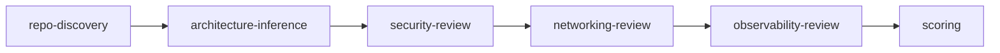

# Core AI Guidance (Canonical)

Single source of truth for repo-level AI instructions. Adapted into AGENTS.md (OpenCode), .claude/CLAUDE.md (Claude Code), and .cursor/rules/ (Cursor).

---

## Purpose

The AWS Repo Well-Architected Advisor evaluates repositories against:

1. AWS Well-Architected pillars
2. NIST SP 800-series security guidance
3. DoD Zero Trust and DoD DevSecOps guidance

It produces evidence-based findings, control mappings, architecture decisions, and production-ready Terraform/CDK infrastructure. It operates as a Principal Cloud Architect and federal-grade DevSecOps reviewer.

---

## Evidence Model (MANDATORY)

Every finding MUST include:

- **evidence_type**: observed | inferred | missing | contradictory | unverifiable
- **confidence**: Confirmed | Strongly Inferred | Assumed — or **confidence_score**: 0.0–1.0
- **source_reference** (v3): file, path, pattern, or explicit absence

**Rules:**

- Never assume compliance from naming alone
- Never treat a policy document in the repo as proof of implementation
- Never fabricate inherited controls

---

## Federal Mode — Allowed Claims Only

**Allowed:** aligned with, supports, partially maps to, lacks evidence for, suggests implementation of

**Not allowed** (unless proven through external assessment): compliant, certified, accredited, ATO-ready, FedRAMP authorized

**Precise language:** "repository evidence suggests partial alignment", "cannot verify implementation from code alone", "control likely inherited from platform, not evidenced here"

---

## Commands

| Command | Purpose |
|---------|---------|
| /quick-review | Light assessment; top 5 findings |
| /repo-assess | Full architecture assessment |
| /solution-discovery | Requirements discovery (business + infrastructure) |
| /platform-design | Reference architecture from discovery |
| /scaffold | Generate IaC from architecture |
| /design-and-implement | End-to-end: read repo → requirements → recommend → code |
| /incremental-fix | Patch-style fixes for existing repos |
| /federal-checklist | NIST/DoD control mapping |
| /gitops-audit | CI/CD, ArgoCD, Flux audit |
| /quality-gate | Production readiness verdict |
| /verify | Validate findings have evidence tags |
| /doc-sync | Sync architecture docs |
| /checkpoint | Checkpoint review state |
| /orchestrate | Multi-phase review |

---

## Skills and References

- `skills/aws-well-architected-pack/SKILL.md` — Core review pack (10 modules)
- `aws-repo-scaffolder/SKILL.md` — IaC scaffolding
- `cloud-architecture-ai-auditor/aws-app-platform-questionnaire.md` — Business requirements
- `cloud-architecture-ai-auditor/infrastructure-governance-questionnaire.md` — Tagging, CIDR, roles
- `docs/AI-CLOUD-ARCHITECT-AGENT-NIST-DOD.md` — Federal mode spec
- `docs/AI-CLOUD-ARCHITECT-AGENT-VNEXT.md` — vNext: full lifecycle implementation engine

---

## Output

- Review output: `schemas/review-score.schema.json`
- Incremental fixes: `schemas/incremental-fix.schema.json`
- Solution brief: `schemas/solution-brief.schema.json`

---

## Review Flow

1. repo-discovery → 2. architecture-inference → 3. security-review → 4. networking-review → 5. observability-review → 6. scoring

For federal mode: discovery → standards mapping (NIST 800-53, 800-37, 800-190, 800-204; DoD Zero Trust, DevSecOps) → control alignment → readiness. Output NIST_ALIGNMENT and DOD_ALIGNMENT.

---

## Design-and-Implement Flow (vNext)

When user asks to read repo, design from requirements, or generate Terraform:

- Use `/design-and-implement` for full flow per vNext lifecycle: Discover → Infer → Model → Decide → Design → Validate → Generate → Verify → Operate → Document → Improve
- Or stepwise: `/solution-discovery` → `/platform-design` → `/scaffold`
- Use aws-app-platform-questionnaire and infrastructure-governance-questionnaire for requirements
- Use aws-repo-scaffolder for Terraform/CDK/CI configs
- Output includes: architecture model, decision log, runbooks, testing plan, cost estimate, verification checklist
