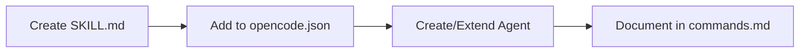

# Development

Local development workflow, testing, and how to extend the advisor.

---

## Local Development Workflow

1. Clone the repo:
   ```bash
   git clone https://github.com/LongTheta/aws-repo-well-architected-advisor.git
   cd aws-repo-well-architected-advisor
   ```

2. Install dependencies:
   ```bash
   npm install
   cd .opencode && bun install   # or npm install
   ```

3. Run tests:
   ```bash
   npm test
   ```

4. Validate schema:
   ```bash
   ./scripts/validate-review-output.sh examples/validated-review-output.json
   ```

5. Make changes, run tests, commit.

---

## Testing Docs and Examples

### Schema Validation

```bash
npx --yes ajv validate -s schemas/review-score.schema.json -d examples/validated-review-output.json
```

### Incremental Fix Schema

```bash
# Validate incremental-fix output (manual; no default example)
npx --yes ajv validate -s schemas/incremental-fix.schema.json -d path/to/fixes.json
```

### Tests

```bash
npm test
# or
node tests/run-all.js
```

Tests cover: schema validation, review-score logic, install script presence.

---

## Adding a New Skill



1. Create a `SKILL.md` file (e.g., `skills/my-skill/SKILL.md`).
2. Follow the SKILL.md format:
   - Frontmatter: `name`, `description`, `risk_tier`
   - Sections: When to Use, Inputs, Outputs, Rules
3. Reference the skill in `opencode.json` instructions:
   ```json
   "instructions": [
     ...
     "skills/my-skill/SKILL.md"
   ]
   ```
4. Create an agent or extend an existing agent to use the skill.
5. Document in `docs/commands.md` if a new command invokes it.

---

## Adding a New Command

1. Edit `.opencode/opencode.json` and `opencode.json`:
   ```json
   "/my-command": {
     "template": "Description of what the command does. Steps...",
     "description": "Short description",
     "agent": "agent-name"
   }
   ```

2. Ensure the agent exists in the `agent` block.

3. Add a command file: `.opencode/commands/my-command.md` (optional but recommended).

4. Update `schemas/command-routing.schema.json` if you use it for validation.

5. Document in `docs/commands.md`.

---

## Adding a New Mode

1. Document the mode in `docs/modes.md`:
   - What changes
   - When to use it
   - What outputs to expect
   - Limitations

2. Update command templates in `opencode.json` to reference the mode when applicable.

3. If the mode requires new behavior, update `docs/AI-CLOUD-ARCHITECT-AGENT-NIST-DOD.md` or agent prompts.

---

## Updating Schemas

1. Edit the schema file (e.g., `schemas/review-score.schema.json`).
2. Validate JSON syntax:
   ```bash
   node -e "JSON.parse(require('fs').readFileSync('schemas/review-score.schema.json','utf8')); console.log('OK');"
   ```
3. Update `examples/validated-review-output.json` if the schema changed.
4. Run validation:
   ```bash
   ./scripts/validate-review-output.sh examples/validated-review-output.json
   ```
5. Update `docs/evidence-model.md` or `docs/commands.md` if new fields affect documentation.

---

## Keeping AI Guidance Synchronized

When updating core AI guidance:

1. Edit `docs/core-ai-guidance.md` first (canonical source)
2. Sync AGENTS.md, .claude/CLAUDE.md, .cursor/rules/aws-well-architected.md to match
3. Preserve tool-specific conventions (OpenCode agents, Claude project instructions, Cursor globs)
4. Agent specs: v5 (`AI-CLOUD-ARCHITECT-AGENT-V5.md`) primary; v2 (`AI-CLOUD-ARCHITECT-AGENT.md`), v3 NIST/DoD (`AI-CLOUD-ARCHITECT-AGENT-NIST-DOD.md`)

---

## Keeping README and Docs Synchronized

- **README.md**: High-level overview; link to detailed docs. Update when adding commands, modes, or major features.
- **docs/commands.md**: Add every new command with inputs, outputs, when to use, example prompt.
- **docs/modes.md**: Add every new mode with behavior, when to use, limitations.
- **docs/repo-structure.md**: Update when adding major folders or files.
- **AGENTS.md**: Update when adding or changing agents.

Run a quick grep before release to ensure no stale references:

```bash
grep -r "old-command" docs/ README.md
```
