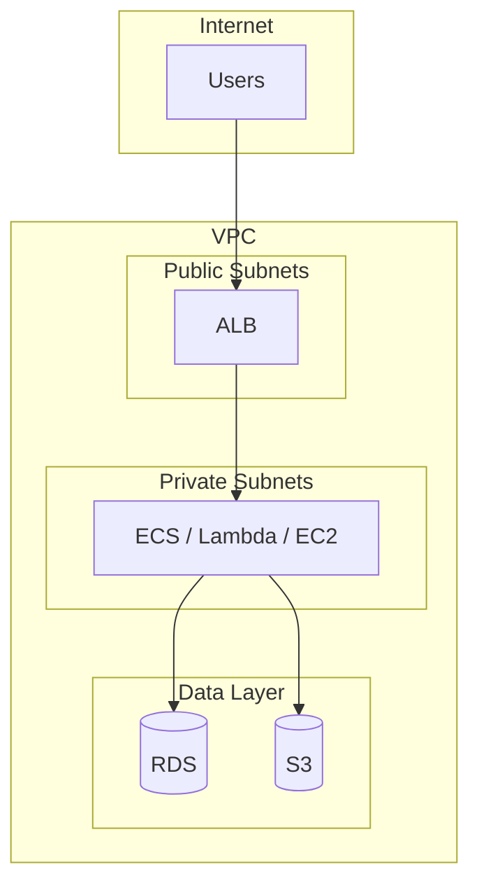
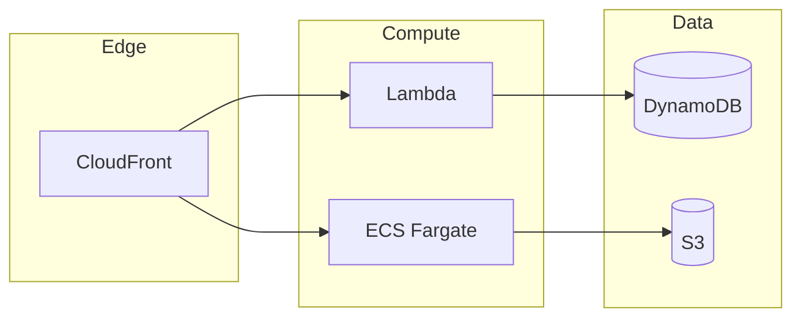
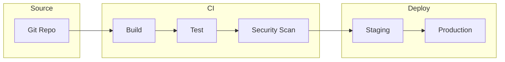
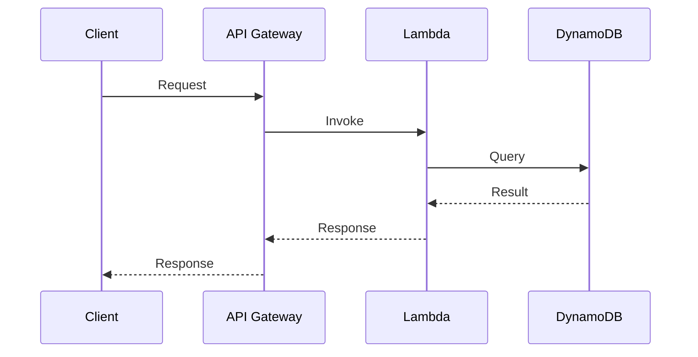

# Diagram Conventions

Visual architecture diagrams for the AWS Repo Well-Architected Advisor. All diagrams use **Mermaid** (text-based, versionable, renders in GitHub/GitLab/VS Code).

---

## Supported Diagram Types

| Type | Use Case | Mermaid Syntax |
|------|----------|----------------|
| **flowchart** | Architecture topology, component relationships, data flow | `flowchart TB` or `flowchart LR` |
| **flowchart (subgraph)** | Layered views (VPC, compute, data) | `subgraph` for grouping |
| **sequenceDiagram** | Request flow, CI/CD pipeline stages | `sequenceDiagram` |
| **erDiagram** | Data model, entity relationships | `erDiagram` |

---

## Diagram Output Schema

When producing diagrams in review or solution output, use this structure:

```json
{
  "diagram": {
    "type": "mermaid",
    "format": "flowchart|sequenceDiagram|erDiagram",
    "content": "flowchart TB\n  A[VPC] --> B[ALB]\n  B --> C[ECS]",
    "caption": "Inferred current-state architecture",
    "confidence": "observed|inferred"
  }
}
```

| Field | Required | Description |
|-------|----------|-------------|
| `type` | Yes | Always `mermaid` |
| `format` | Yes | `flowchart`, `sequenceDiagram`, or `erDiagram` |
| `content` | Yes | Raw Mermaid source (escape newlines as `\n`) |
| `caption` | Yes | Human-readable title |
| `confidence` | No | `observed` (from repo) or `inferred` (derived) |

---

## Inferred Architecture Template

Use for **current-state** architecture from repo artifacts:



**Conventions:**
- Use `subgraph` for VPC, AZs, or logical layers
- Use `[( )]` for databases/storage
- Use `[ ]` for compute/network
- Left-to-right: Internet → edge → compute → data

---

## Target Architecture Template

Use for **recommended** architecture after design decisions:



---

## CI/CD Pipeline Template

Use for deployment flow:



---

## Data Flow Template

Use for request/event flow:



---

## STRICT Rules (If diagram violates rules → FAIL)

Diagrams must pass validation. Violations cause output failure.

### Public vs Private

- **Public subnets**: Only edge/ingress components (CloudFront, ALB, API Gateway). Must be in `public_exposure` array.
- **Private subnets**: Compute and data must be in private zones. Never expose RDS, DynamoDB, Lambda (directly) to internet.
- **Trust boundaries**: Nodes in `trust_boundaries` zones must not have public exposure unless explicitly edge/ingress.

### AWS Naming

- Use canonical AWS service names: **ALB**, **ECS**, **RDS**, **DynamoDB**, **S3**, **Lambda**, **API Gateway**, **CloudFront**, **VPC**, **KMS**.
- Do not use generic terms (e.g. "Load Balancer" → use "ALB"; "Database" → use "RDS" or "DynamoDB").

### Environment Grouping

- Group nodes by zone: `internet`, `edge`, `compute`, `data`, `security`.
- Use `subgraph` for each zone. Zones must match `architecture_graph.zones`.

### Edge Labels

- Every edge must have a `label` describing the flow (e.g. `HTTPS`, `API`, `Invoke`, `Query`, `GetObject`).
- Labels must be non-empty for data/control flow edges.

### Security Zones

- `trust_boundaries` must be defined when multiple zones exist.
- Public-facing nodes must have `public_exposure: true` and appear in `public_exposure` array.
- Private nodes must have `public_exposure: false` or be omitted from `public_exposure`.

---

## Diagram Quality Rules

1. **Evidence-based**: Only include components with repo evidence; mark inferred with `(inferred)` in labels if needed
2. **Consistent naming**: Use AWS service names (ALB, ECS, RDS) not generic terms
3. **Direction**: Prefer top-to-bottom (`TB`) for architecture; left-to-right (`LR`) for pipelines
4. **Minimal**: Avoid clutter; one diagram per view (current-state vs target vs pipeline)
5. **Caption**: Always provide a caption describing what the diagram shows

---

## Architecture Graph → Mermaid Workflow

1. **Build graph**: `python3 scripts/build_architecture_graph.py --scenario <scenario.json>` (or from Terraform)
2. **Render Mermaid**: `python3 scripts/graph_to_mermaid.py <graph.json> [output.mmd]` or `node scripts/render-mermaid.js`
3. **Validate**: `python3 scripts/validate_mermaid.py <graph.json> [diagram.mmd]` or `npm run validate:diagrams`

Example: `examples/architecture-graph-example.json` → `examples/architecture-diagram-example.mmd`

---

## References

- [Mermaid Live Editor](https://mermaid.live/) — Test diagrams
- [Mermaid flowchart docs](https://mermaid.js.org/syntax/flowchart.html)
- [Mermaid sequenceDiagram docs](https://mermaid.js.org/syntax/sequenceDiagram.html)
- `schemas/architecture-graph.schema.json` — Structured graph for Mermaid generation
- `scripts/graph_to_mermaid.py` — Graph → Mermaid (Python)
- `scripts/validate_mermaid.py` — Validation (Python)
