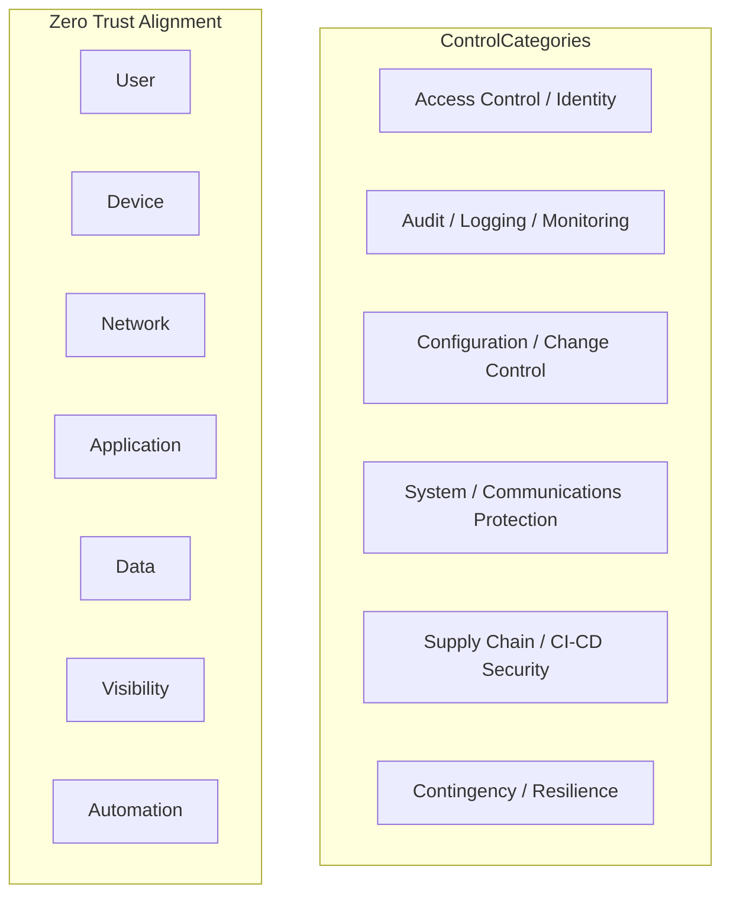

# Federal Mode (NIST / DoD)

What federal mode is, which standards the repo aligns to, and what can and cannot be inferred.

---

## What Federal Mode Is

Federal mode is enabled by `/federal-checklist`. It overlays NIST SP 800-series and DoD guidance on the standard Well-Architected review. The advisor maps findings to control families and outputs **NIST_ALIGNMENT** and **DOD_ALIGNMENT** ratings. It uses **allowed claims only** — never "compliant", "certified", or "FedRAMP authorized".

---

## NIST / DoD Concepts the Repo Aligns To

### NIST Core

| Standard | Purpose |
|----------|---------|
| NIST SP 800-53 Rev. 5 | Security and privacy control catalog |
| NIST SP 800-37 Rev. 2 | RMF lifecycle and continuous monitoring |
| NIST SP 800-190 | Application Container Security Guide |
| NIST SP 800-204A | Secure microservices using service mesh |
| NIST SP 800-204B | Attribute-based access control for microservices |
| NIST SP 800-204C | DevSecOps for microservices with service mesh |
| NIST SP 800-204D | Software supply chain security in DevSecOps CI/CD |

### DoD Core

| Document | Purpose |
|----------|---------|
| DoD Zero Trust Strategy | Zero Trust principles |
| DoD Zero Trust Reference Architecture | Architecture patterns |
| DoD Zero Trust Capability Execution Roadmap | Execution guidance |
| DoD Enterprise DevSecOps Fundamentals | DevSecOps practices |

---

## "Alignment" Versus "Compliance"

| Term | Meaning |
|------|---------|
| **Alignment** | Repository evidence suggests the design or implementation supports or partially maps to a control or principle. Evidence-based; does not imply formal assessment. |
| **Compliance** | Formal determination by an authorized body (e.g., assessor, AOs) that controls are implemented and effective. Requires assessment, not repo review. |

The advisor outputs **alignment** ratings (STRONG, PARTIAL, WEAK). It does **not** output compliance, certification, or accreditation.

---

## Allowed Claims

**Allowed:**

- aligned with
- supports
- partially maps to
- lacks evidence for
- suggests implementation of

**Not allowed** (unless explicitly proven through external assessment evidence):

- compliant
- certified
- accredited
- ATO-ready
- FedRAMP authorized

**Precise language examples:**

- "Repository evidence suggests partial alignment with AC-2 (Account Management)."
- "Cannot verify implementation from code alone."
- "Control likely inherited from platform, not evidenced here."

---

## What Can Be Inferred from Repo Evidence

- **Explicit implementation**: IaC or config that directly implements a control (e.g., IAM policy, encryption config)
- **Design intent**: Architecture that supports a control (e.g., private subnets, least-privilege roles)
- **Gaps**: Absence of config that would evidence a control
- **Contradictions**: Conflicting configs that undermine a control

---

## What Cannot Be Inferred from Repo Evidence

- **Runtime behavior**: Whether controls are actually enforced at runtime
- **Operational procedures**: Runbooks, incident response, change management
- **Platform inheritance**: CSP-managed controls not visible in repo
- **Human factors**: Training, access reviews, physical security
- **Formal assessment outcome**: FedRAMP, ATO, or similar authorization

---

## Additional Evidence Needed for Real Assessment

For formal authorization or assessment work, beyond repo review:

- **Runtime verification**: Live checks of controls (e.g., actual IAM policies, encryption status)
- **Operational evidence**: Procedures, logs, audit records
- **Platform documentation**: CSP compliance documentation (e.g., FedRAMP package)
- **Assessment body**: Authorized assessor, AOs, or equivalent
- **Continuous monitoring**: Ongoing evidence collection per RMF

---

## Control Mapping Categories

When federal mode runs, findings are mapped to:

| Category | Examples |
|----------|----------|
| Access Control / Identity | IAM least privilege, role separation, workload identity (IRSA), service-to-service auth |
| Audit / Logging / Monitoring | Centralized logging, CloudTrail, flow logs, immutable retention, alerting |
| Configuration / Change Control | Git-based source of truth, branch protection, environment promotion, policy-as-code |
| System / Communications Protection | Encryption in transit/rest, private subnets, SG/NACL, service mesh |
| Supply Chain / CI-CD Security | SBOM, artifact provenance, dependency/image scanning, signature verification |
| Contingency / Resilience | Multi-AZ, backups, restore testing, failover, health checks |
| Zero Trust Alignment | User, Device, Network, Application, Data, Visibility, Automation pillars |
