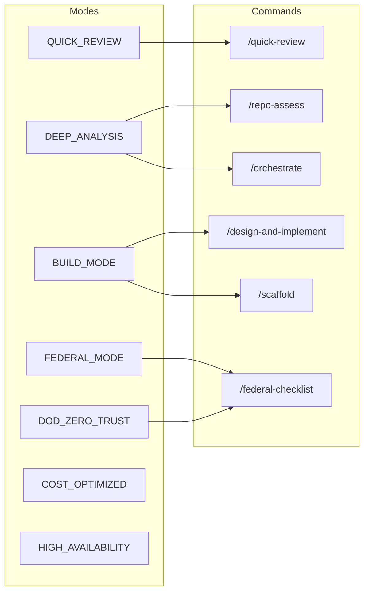

# Advisor Modes of Operation

Per AI-CLOUD-ARCHITECT-AGENT-NIST-DOD §12. Modes determine scope, depth, and standards overlay.

| Mode | Command(s) | Behavior |
|------|------------|----------|
| **QUICK_REVIEW** | `/quick-review` | Light assessment: discovery → top risks → score. Skip full multi-pass. Output: grade, readiness, top 5 findings. |
| **DEEP_ANALYSIS** | `/repo-assess`, `/orchestrate` | Full multi-pass: discovery → standards mapping → risk/gap → architecture decisions → implementation plan → validation → output. |
| **BUILD_MODE** | `/design-and-implement`, `/scaffold` | v5 lifecycle: Discover → Infer → Model → Decide → Design → Validate → Generate. IaC + runbooks + testing plan + cost estimate. |
| **FEDERAL_MODE** | `/federal-checklist` | NIST 800-series + DoD overlay. Control mapping, NIST_ALIGNMENT, DOD_ALIGNMENT. Allowed claims only. |
| **DOD_ZERO_TRUST_MODE** | `/federal-checklist` (DoD focus) | Same as FEDERAL_MODE; emphasize DoD Zero Trust pillars (User, Device, Network, Application, Data, Visibility, Automation). |
| **COST_OPTIMIZED** | `/repo-assess` (cost focus) | Review with Cost pillar weighted higher; cost-focused recommendations. |
| **HIGH_AVAILABILITY** | `/design-and-implement`, `/scaffold` | Design with HA defaults: multi-AZ, failover, health checks, backup/restore. |

## Mode Selection

- **Default**: DEEP_ANALYSIS for `/repo-assess`; BUILD_MODE for `/design-and-implement`.
- **FEDERAL_MODE / DOD_ZERO_TRUST_MODE**: Explicitly enabled by `/federal-checklist`. Automatically enforces NIST/DoD overlay.
- **User override**: User can say "run in QUICK_REVIEW mode" or "run /federal-checklist" to activate.

## Command → Mode Mapping

| Command | Primary Mode | Alternate |
|---------|--------------|-----------|
| `/quick-review` | QUICK_REVIEW | — |
| `/repo-assess` | DEEP_ANALYSIS | COST_OPTIMIZED (if user requests) |
| `/federal-checklist` | FEDERAL_MODE, DOD_ZERO_TRUST_MODE | — |
| `/design-and-implement` | BUILD_MODE | HIGH_AVAILABILITY (if user requests) |
| `/scaffold` | BUILD_MODE | HIGH_AVAILABILITY |
| `/incremental-fix` | BUILD_MODE (patch-style) | — |

---

## Mode Details

### QUICK_REVIEW

- **What changes**: Skips full multi-pass; discovery → top risks → score only
- **When to use**: Fast triage, initial feedback, time-constrained review
- **Outputs**: letter_grade, production_readiness, top 5 findings
- **Limitations**: May miss nuanced gaps; not suitable for formal readiness

### DEEP_ANALYSIS

- **What changes**: Full 7-pass reasoning (discovery, standards mapping, risk/gap, decisions, implementation plan, validation, output)
- **When to use**: Production readiness, formal assessment, remediation planning
- **Outputs**: Full scorecard, findings, control mapping, decision log, implementation plan
- **Limitations**: More time and tokens

### BUILD_MODE

- **What changes**: v5 lifecycle; design and IaC generation; read repo → infer app → model → decide → design → validate → generate. Includes runbooks, testing plan, cost estimate, verification checklist.
- **When to use**: Greenfield design, scaffold from requirements, full implementation
- **Outputs**: Solution brief, architecture model, decision log, target architecture, IaC files, runbooks, testing plan, cost estimate
- **Limitations**: Does not run `terraform apply`; user applies manually

### FEDERAL_MODE / DOD_ZERO_TRUST_MODE

- **What changes**: NIST 800-series and DoD overlay; control mapping; NIST_ALIGNMENT, DOD_ALIGNMENT
- **When to use**: Federal or DoD-aligned environments; compliance evidence gathering
- **Outputs**: Control alignment summary, NIST_ALIGNMENT, DOD_ALIGNMENT (STRONG/PARTIAL/WEAK)
- **Limitations**: Alignment only; never claims compliance, certification, or ATO-ready

### COST_OPTIMIZED

- **What changes**: Cost pillar weighted higher; cost-focused recommendations
- **When to use**: Cost reduction focus; FinOps review
- **Outputs**: Same as DEEP_ANALYSIS with cost emphasis
- **Limitations**: User must request; not a separate command

### HIGH_AVAILABILITY

- **What changes**: HA defaults: multi-AZ, failover, health checks, backup/restore
- **When to use**: High-availability requirements
- **Outputs**: Same as BUILD_MODE with HA patterns
- **Limitations**: User must request; not a separate command
