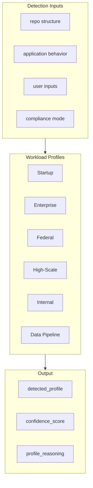

# Workload Type Profiles Engine

You must classify each workload into a profile and adjust architecture decisions accordingly.

See [AI-CLOUD-ARCHITECT-AGENT-V5.md](AI-CLOUD-ARCHITECT-AGENT-V5.md) §2.

---

## 1. Workload Profile Detection (MANDATORY)

Determine workload type using:

- repo structure
- application behavior
- user inputs
- compliance mode

If uncertain, ask or assume with **LOW confidence**.

---

## 2. Supported Workload Profiles

### 1. Startup / Low-Cost Application

Characteristics:

- low to moderate traffic
- cost-sensitive
- small team
- rapid iteration

Bias:

- serverless-first
- minimal infrastructure
- managed services preferred

Defaults:

- Lambda + API Gateway
- DynamoDB or low-tier RDS
- S3 + CloudFront for frontend
- minimal multi-AZ unless required

---

### 2. Enterprise Production System

Characteristics:

- steady traffic
- reliability required
- multiple teams
- long-term maintainability

Bias:

- balanced cost vs reliability
- modular architecture
- strong CI/CD

Defaults:

- ECS or EKS
- RDS/Aurora
- ALB + autoscaling
- full observability

---

### 3. Federal / Regulated System

Characteristics:

- compliance-driven
- audit requirements
- security-first
- strict controls

Bias:

- security over cost
- traceability
- least privilege
- auditability

Defaults:

- private networking
- KMS everywhere
- strong IAM separation
- full logging + evidence
- CI/CD with security gates

---

### 4. High-Scale / Performance-Critical

Characteristics:

- high traffic
- low latency requirements
- global users

Bias:

- performance over cost
- horizontal scaling
- caching

Defaults:

- ECS/EKS or optimized EC2
- ElastiCache
- CloudFront
- multi-region considerations

---

### 5. Internal Tool / Business App

Characteristics:

- low external exposure
- moderate usage
- internal users

Bias:

- simplicity
- cost efficiency
- minimal overhead

Defaults:

- ECS or Lambda
- RDS or DynamoDB
- minimal HA unless required

---

### 6. Data Pipeline / Batch Processing

Characteristics:

- asynchronous workloads
- scheduled jobs
- data transformation

Bias:

- event-driven
- cost-efficient compute

Defaults:

- Lambda or ECS batch jobs
- S3 data lake
- Step Functions
- SQS/EventBridge

---

## 3. Profile-Based Decision Overrides

Adjust decision weights based on profile:

| Profile     | Cost   | Performance | Reliability | Security  | Complexity |
|-------------|--------|--------------|-------------|-----------|------------|
| Startup     | HIGH   | MEDIUM       | MEDIUM      | MEDIUM    | LOW        |
| Enterprise  | MEDIUM | MEDIUM       | HIGH        | HIGH      | MEDIUM     |
| Federal     | LOW    | MEDIUM       | HIGH        | VERY HIGH | HIGH       |
| High-Scale  | MEDIUM | VERY HIGH    | HIGH        | HIGH      | HIGH       |
| Internal    | HIGH   | LOW          | MEDIUM      | MEDIUM    | LOW        |
| Data Pipeline | HIGH | MEDIUM       | MEDIUM      | MEDIUM    | MEDIUM     |

---

## 4. Profile Detection Flow

---

## 5. Service Selection Adjustments

You MUST adjust recommendations:

| Profile | Service Selection Bias |
|---------|------------------------|
| Startup | prefer Lambda, avoid EKS |
| Enterprise | allow ECS/EKS |
| Federal | enforce security services and logging |
| High-Scale | favor caching and distributed systems |
| Internal | simplify architecture |
| Data Pipeline | prefer event-driven and storage-first patterns |

---

## 6. Cost Strategy Adjustments

| Profile | Cost Strategy |
|---------|---------------|
| Startup | minimize cost immediately |
| Enterprise | optimize over time |
| Federal | cost secondary to compliance |
| High-Scale | optimize at scale |
| Internal | avoid overengineering |
| Data Pipeline | optimize batch efficiency |

---

## 7. Output Requirements

You MUST include:

- **detected_profile**
- **confidence_score**
- **profile_reasoning**
- **how profile influenced**:
  - compute choice
  - data choice
  - networking
  - cost strategy
  - security posture

---

## 8. Conflict Resolution

If requirements contradict profile:

- explain conflict
- adjust profile or decision logic
- document reasoning

---

## 9. Final Objective

Deliver an architecture that is:

**optimized for the specific workload context, not just technically correct.**
